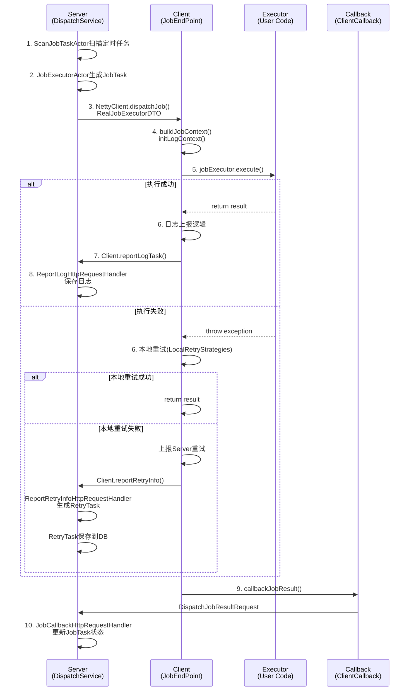
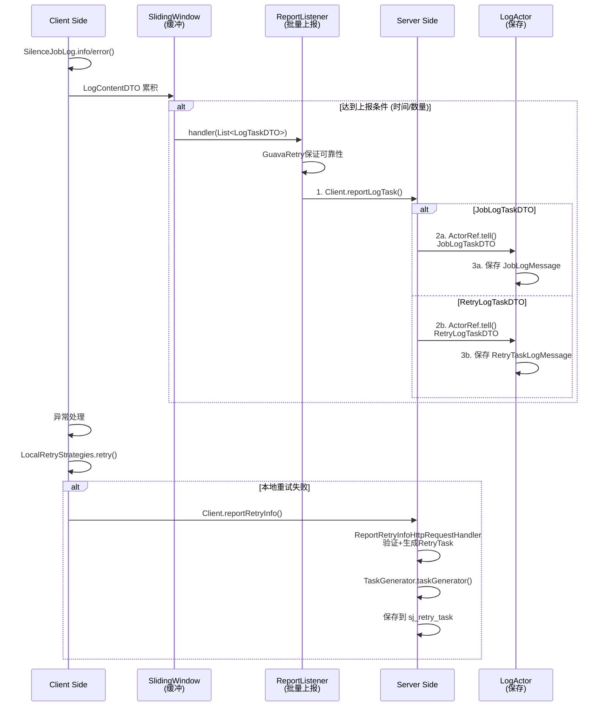
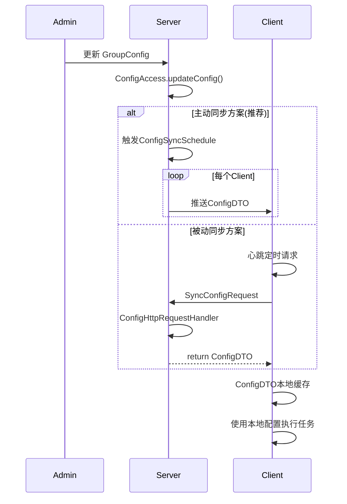

# Silence Job 系统架构深度分析

> **核心设计理念**：理解系统依赖关系，识别设计问题，为优化重构奠定基础。

---

## 1. 系统概览

Silence Job 是一个**分布式定时任务调度系统**，采用 **Server-Client** 架构。

### 核心模块划分

```
silence-job-center/
├── silence-job-common/           # 共享领域模型
├── silence-job-client/            # 客户端框架
├── silence-job-server/            # 服务端框架
├── silence-job-client-starter/    # 客户端启动器
└── silence-job-server-starter/    # 服务端启动器
```

---

## 2. Server 端核心流程分析

### 2.1 任务调度流程（重点工作流）

**流程图：**
```
DispatchService (每 30s 扫一次)
    ↓
ScanBucketActor (扫描分配的桶)
    ↓
ScanJobTaskActor (扫描待调度的定时任务)
    ├─ listAvailableJobs() [从DB查询满足调度条件的Job]
    ├─ processJob() [更新下次触发时间]
    └─ processJobPartitionTasks() [准备任务]
        ↓
    JobTimerTask (延迟任务触发)
        ↓
    TaskExecuteDTO 进入时间轮
        │ (延迟到触发时间后)
        ↓
    JobExecutorActor (接收 TaskExecuteDTO)
        ├─ doExecute() [事务执行]
        │   ├─ 查询Job和TaskBatch信息
        │   ├─ 生成JobTask (分片、Map等策略)
        │   └─ 事务提交后触发
        │
        ├─ jobExecutor.execute() [按类型执行]
        │   ├─ BroadcastJobExecutor (广播)
        │   ├─ ClusterJobExecutor (集群)
        │   └─ MapReduceJobExecutor (MapReduce)
        │
        └─ jobRealTaskExecutorActor.tell(RealJobExecutorDTO)
            ↓
        JobRealTaskExecutorActor (调度到客户端)
            └─ NettyClient.dispatchJob()
                ↓
            Client 端接收执行
```

**关键类：**
- `DispatchService`: 系统调度入口
- `ScanJobTaskActor`: 定时任务扫描
- `JobExecutorActor`: 任务执行协调
- `JobExecutor`: 多种执行策略 (Strategy 模式)

**数据流：**
```
Job (定时任务定义)
  → JobTaskBatch (一次调度的任务批次)
    → JobTask (分片后的单个任务)
      → RealJobExecutorDTO (发送到客户端)
```

---

### 2.2 任务完成和重试流程

**流程图：**
```
Client 执行完成
    ↓
Client.callbackJobResult()
    ↓
JobCallbackHttpRequestHandler
    ├─ 解析 DispatchJobResultRequest
    ├─ 调用 ClientCallbackService.doCallback()
    │   ├─ 更新 JobTask 状态
    │   └─ 保存执行结果
    │
    └─ JobTask.SUCCEED? → 标记完成
                    ↗
                    │ 失败或超时?
                    ↓
              RetryTaskBatchHandler
                ├─ 生成 RetryTask
                ├─ 保存到 sj_retry_task 表
                └─ 发送 RetryTaskDTO 到 Client
                    ↓
              Client 重试 (本地 + 远程)
```

---

### 2.3 日志收集流程

**流程图：**
```
Client 执行任务
    ↓ (日志通过 LogUtil 收集)
    ↓
SilenceJobLog.info/error()
    ↓
Client.reportLogTask() (批量上报)
    ↓
ReportLogHttpRequestHandler
    ├─ 解析 JobLogTaskDTO 和 RetryLogTaskDTO
    ├─ 发送给 JobLogActor (for JobLogTaskDTO)
    └─ 发送给 RetryLogActor (for RetryLogTaskDTO)
        ↓
    对应Actor保存日志
        ├─ JobLogMessage (sj_job_log_message)
        └─ RetryTaskLogMessage (sj_retry_task_log_message)
```

**日志DTO 家族：**
- `LogTaskDTO` (基类): 日志上报的通用信息
- `JobLogTaskDTO` (extends LogTaskDTO): 定时任务日志
- `RetryLogTaskDTO` (extends LogTaskDTO): 重试任务日志

---

## 3. Client 端核心流程分析

### 3.1 任务接收和执行流程

**流程图：**
```
Server 调度
    ↓
Client.dispatchJob()
    ↓
JobEndPoint.dispatchJob()
    ├─ buildJobContext() [构建执行上下文]
    ├─ initLogContext() [初始化日志]
    └─ jobExecutor.jobExecute()
        ├─ AnnotationJobExecutor (注解方式)
        ├─ AbstractJobExecutor (模板方式)
        ├─ AnnotationMapJobExecutor
        └─ AnnotationMapReduceJobExecutor
            ↓
        执行用户定义的任务
            ↓
        捕获结果/异常
            ↓
        Client.callbackJobResult()
            ↓
        Server 接收回调
```

**关键类：**
- `JobEndPoint`: 接收调度请求
- `JobContext`: 任务执行上下文
- `JobExecutor`: 多种执行方式

---

### 3.2 本地重试流程

**流程图：**
```
执行任务异常
    ↓
LocalRetryStrategies.retry()
    ├─ 本地重试 (GuavaRetry)
    │   ├─ 指数退避算法
    │   ├─ 可配置的重试次数
    │   └─ 重试间隔
    │
    └─ 本地重试都失败?
        ↓
      上报到 Server (如果启用)
        ↓
      RemoteRetryStrategies.doReport()
        ↓
      Client.reportRetryInfo()
        ↓
      ReportRetryInfoHttpRequestHandler
        ├─ 验证数据
        ├─ TaskGenerator 生成 RetryTask
        └─ 保存到数据库
```

---

### 3.3 日志上报流程

**流程图：**
```
任务执行期间
    ↓
SilenceJobLog.info/error() (通过 LogManager)
    ↓
LogContentDTO 累积
    ↓ (每 5s 或达到阈值)
    ↓
SlidingWindow 滑动窗口
    ↓
ReportListener.handler()
    ├─ GuavaRetry 保证可靠性
    └─ Client.reportLogTask()
        ↓
        Server ReportLogHttpRequestHandler
            ├─ 分离 JobLogTaskDTO 和 RetryLogTaskDTO
            └─ 分别发送给对应 Actor
```

---

## 4. 核心时序图

### 4.1 任务从分配到完成的完整链路



### 4.2 日志和重试上报的完整链路



### 4.3 配置同步流程



---

## 5. 架构问题识别

### 5.1 模块职责混杂问题

| 问题 | 当前 | 建议 |
|------|------|------|
| **DTO 位置混乱** | LogTaskDTO 在 server-api, JobLogTaskDTO 在 common-core, 都有继承关系，循环依赖 | LogTaskDTO 应只在 common-core，server-api 做兼容导入 |
| **Actor 模式过度使用** | 小任务也用 Actor，导致消息队列堆积 | Actor 仅用于高并发异步任务 |
| **重试逻辑分散** | 本地重试、远程重试分别在 Client 和 Server，代码重复 | 统一的重试策略框架 |

### 5.2 流程设计问题

| 问题 | 当前 | 建议 |
|------|------|------|
| **状态机不清晰** | JobTaskBatchStatus 分散在多处，转移逻辑不统一 | 明确的状态机模型，所有转移通过统一入口 |
| **日志收集性能** | SlidingWindow + ReportListener，但配置不灵活 | 可配置的窗口大小和触发条件 |
| **错误恢复机制** | 网络失败重试了，但没有补偿机制 | 引入 Saga 或 Event Sourcing |

### 5.3 模块拆分问题

**当前模块结构：**
```
silence-job-server/
├── silence-job-server-core/        # 混合了 Actor、Service、Domain
├── silence-job-server-job-task/    # 任务执行（ 8 个 support 子模块）
├── silence-job-server-retry-task/  # 重试处理（职责与 job-task 重叠）
├── silence-job-server-common/      # 通用工具（包含 Handler、RPC）
└── silence-job-server-app/         # 应用入口
```

**问题：**
1. **core 太大太全**: Domain, Service, DAO 混在一起
2. **job-task 和 retry-task 职责重叠**: 都在做任务生成、调度、日志
3. **server-common 不够通用**: 涉及 HTTP Handler、RPC 等业务逻辑
4. **分层不清**: 没有明确的应用层 → 领域层 → 基础设施层

---

## 6. 建议的优化方向

### 6.1 DTO 整理方案 ✅ (已完成)

**现状：**
```
LogTaskDTO (位置: server-api)
    ↑
    ├─ JobLogTaskDTO (位置: common-core)
    └─ RetryLogTaskDTO (位置: ???)
```

**优化后：**
```
common-core/dto/
    ├─ LogTaskDTO (基类)
    ├─ JobLogTaskDTO (extends LogTaskDTO)
    └─ RetryLogTaskDTO (extends LogTaskDTO)

server-api/dto/
    └─ LogTaskDTO (兼容导入，extends common-core.LogTaskDTO)
```

**优势：**
- ✅ 消除循环依赖
- ✅ 单一职责，DTO 只在 common-core
- ✅ 向后兼容，现有代码无需改动

### 6.2 流程层设计方案

**当前问题：** Actor 过度使用，消息堆积

**优化方案：**
```
Application Layer (Controller/Handler)
    ↓
Command Service (用户命令处理)
    ├─ DispatchCommand
    ├─ CallbackCommand
    └─ ReportCommand
    ↓
Domain Service (业务逻辑)
    ├─ JobScheduleService
    ├─ RetryService
    └─ LogService
    ↓
Infrastructure (持久化/RPC)
    ├─ JobRepository
    ├─ RetryRepository
    └─ NettyClient
```

**Actor 仅用于：**
- 异步任务派发（JobExecutorActor → NettyClient）
- 日志聚合（ReportListener → BatchInsert）

### 6.3 模块重组方案

**优化后的结构：**
```
silence-job-server/
├── silence-job-server-core/
│   ├── src/main/java/domain/         # 领域模型
│   ├── src/main/java/service/        # 业务服务
│   └── src/main/java/repository/     # 数据访问
│
├── silence-job-server-job/           # 新建：Job 调度专属
│   ├── src/main/java/handler/        # HTTP 处理器
│   ├── src/main/java/service/        # Job 业务逻辑
│   └── src/main/java/executor/       # 执行器策略
│
├── silence-job-server-retry/         # 新建：Retry 专属
│   └── 独立的重试处理流程
│
├── silence-job-server-log/           # 新建：Log 收集专属
│   └─ 统一的日志处理
│
└── silence-job-server-app/           # 应用启动
    └─ 聚合以上模块
```

**优势：**
- 职责单一
- 减少模块间耦合
- 便于测试和维护
- 支持更灵活的部署策略

### 6.4 状态机清晰化方案

**Job 执行状态流转：**
```
PENDING (待调度)
    ↓ (定时触发)
PREPARED (已准备)
    ↓ (发送到 Client)
DISPATCHED (已分配)
    ↓ 
┌─→ EXECUTING (执行中)
│   ↓
│   ├─→ SUCCEED (成功) ✓
│   └─→ FAILED (失败)
│       ├─→ RETRY (重试中)
│       └─→ ABANDONED (放弃)
│
└─→ TIMEOUT (超时)
    └─→ RETRY (重试中)
```

**实现：**
```java
public interface JobTaskStateTransition {
    void toPrepared(JobTask task);
    void toDispatched(JobTask task);
    void toSucceed(JobTask task);
    void toFailed(JobTask task, Throwable reason);
    // 禁止直接修改状态，所有转移必须通过此接口
}
```

---

## 7. 系统交互矩阵

| 交互关系 | 方向 | 协议 | 说明 |
|---------|------|------|------|
| Server → Client | 推 | Netty RPC | dispatchJob / syncConfig |
| Client → Server | 推 | Netty RPC | callbackJobResult / reportRetryInfo / reportLogTask |
| Server 内部 | 异步消息 | Pekko Actor | 任务分派、日志保存 |
| Client 内部 | 事件驱动 | Spring Event | 日志聚合、本地重试 |

---

## 8. 关键依赖分析

### 高风险依赖（强耦合）
- `silence-job-common-core` ← `silence-job-common-server-api` (循环) ⚠️
- `silence-job-server-job-task` ← `silence-job-server-core` (强)
- `silence-job-server-retry-task` ← `silence-job-server-job-task` (重复代码)

### 优先修复项
1. ✅ **消除 DTO 循环依赖** (已完成)
2. 🔄 **提取公共的任务处理逻辑** (Job + Retry)
3. 🔄 **分离 Handler 和 Service**
4. 🔄 **引入状态机框架**

---

## 9. 下一步行动计划

### Phase 1: 架构澄清 (当前)
- [x] 分析核心流程
- [x] 绘制时序图
- [ ] 确认团队对架构的理解

### Phase 2: 基础设施修复
- [ ] 完成 DTO 优化 (已 30%)
- [ ] 提取 TaskContext 统一接口
- [ ] 引入状态机模式

### Phase 3: 模块重组
- [ ] 拆分 job-task 和 retry-task 的公共逻辑
- [ ] 创建 silence-job-server-job 独立模块
- [ ] 创建 silence-job-server-retry 独立模块

### Phase 4: 质量保证
- [ ] 编写集成测试
- [ ] 性能基准测试
- [ ] 文档完善

---

## 10. 设计原则总结

### "大道至简" 的实现
1. **单一职责**: 每个模块只做一件事
2. **清晰的状态机**: 业务流程可视化，易于理解
3. **统一的接口**: 减少学习成本，增强可维护性
4. **最少化层级**: 避免过度设计，直接 Service → Repository
5. **自解释的代码**: 类名、方法名要表达意图

### 避免的坑
- ❌ 过度使用设计模式（Actor/Strategy 等）
- ❌ 模块拆分过细，导致高内聚低
- ❌ 状态隐含在代码中，难以追踪
- ❌ 日志系统与业务逻辑耦合

---

**文档版本**: 1.0  
**最后更新**: 2026-02-03  
**维护者**: Architecture Team
