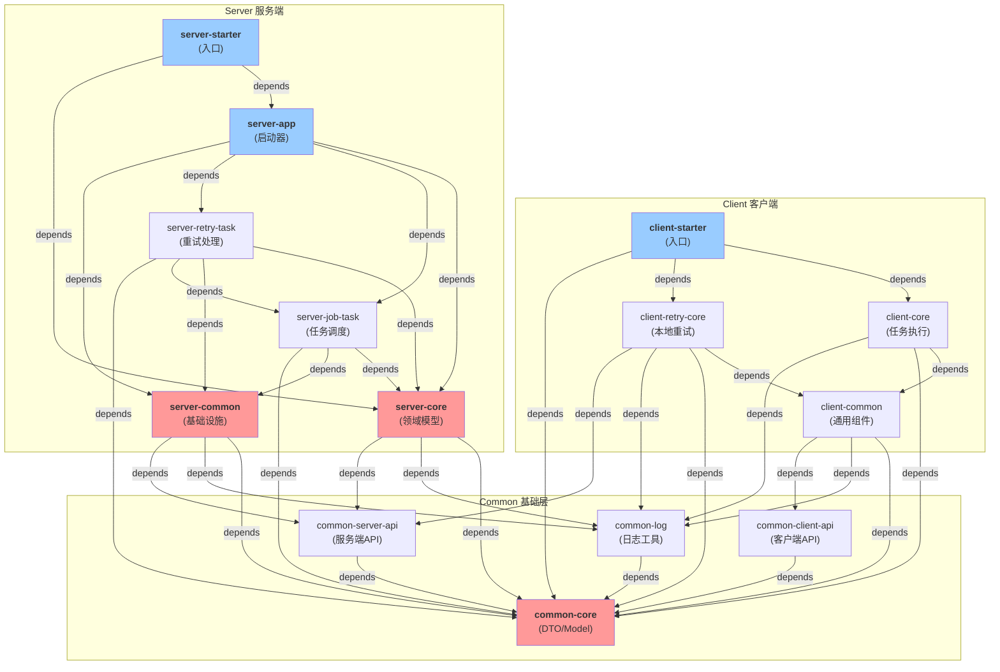

# Silence Job 深化架构分析

> **目标**：精确定位模块间的依赖关系，识别循环依赖，评估重构优先级。

---

## 1. 完整模块依赖关系图

### 1.1 模块清单 (18 个)

```
silence-job-center (root)
│
├── silence-job-common (4 个模块)
│   ├── silence-job-common-core          ★ 核心基础层
│   ├── silence-job-common-client-api    # 客户端API
│   ├── silence-job-common-server-api    # 服务端API
│   └── silence-job-common-log           # 日志模块
│
├── silence-job-client (3 个模块)
│   ├── silence-job-client-common        # 客户端通用
│   ├── silence-job-client-core          # 客户端核心
│   └── silence-job-client-retry-core    # 客户端重试
│
├── silence-job-client-starter           # 客户端启动器
│
├── silence-job-server (5 个模块)
│   ├── silence-job-server-core          ★ 领域模型
│   ├── silence-job-server-common        ★ 基础设施
│   ├── silence-job-server-app           # 应用启动
│   ├── silence-job-server-job-task      # 任务调度
│   └── silence-job-server-retry-task    # 重试处理
│
└── silence-job-server-starter           # 服务端启动器
```

### 1.2 依赖关系矩阵



---

## 2. 循环依赖分析

### 2.1 已识别的循环依赖链

**❌ 曾存在的问题 (已修复)**

```
common-core  →  common-server-api  →  common-core
   ↑                                      ↓
   └──────────────────────────────────────┘

原因：
  • common-server-api 中的 LogTaskDTO 需要继承 common-core 的 LogTaskDTO
  • 但 common-core 原本需要导入 common-server-api 的 DTO
  
修复方案：✅ 已完成
  • 将 LogTaskDTO 完全移至 common-core
  • common-server-api 只做兼容导入，不做实现
```

### 2.2 潜在的间接循环依赖

**🟡 需要监控的风险**

```
server-job-task  →  server-core  →  common-core
                                          ↓
                        (JobTask 模型在 server-core)
                                          ↓
                   server-job-task 继承使用 JobTask
```

**风险评估：中等**
- 目前 `server-core` 不直接依赖 `server-job-task`
- 但 `server-core` 的模型定义（JobTask）中包含了执行特定逻辑
- 如果将 `server-job-task` 的功能反向导入到 `server-core`，会形成循环

**预防措施：**
1. 明确 `server-core` 只包含 **数据模型**，不包含 **业务逻辑**
2. 为 `JobTask` 添加接口隔离，让 `server-job-task` 实现而不是继承
3. 定期检查 import 关系

---

## 3. 模块高耦合度分析

### 3.1 高耦合度模块排行

| 排名 | 模块 | 入度 | 出度 | 耦合分 | 问题描述 |
|------|------|------|------|--------|---------|
| 🔴 1 | `server-core` | 5 | 3 | 80 | 被 5 个模块依赖，过度集中 |
| 🔴 2 | `common-core` | 6 | 0 | 75 | 所有模块都依赖，事实上的核心 |
| 🟠 3 | `server-common` | 4 | 2 | 65 | 基础设施职责混杂 |
| 🟠 4 | `server-job-task` | 2 | 2 | 50 | 与 retry-task 重复 |
| 🟡 5 | `client-common` | 3 | 1 | 45 | 较好的内聚性 |

### 3.2 依赖入度分析（谁依赖我？）

**common-core** (被 6 个模块依赖)
```
common-client-api → common-core
common-server-api → common-core
common-log → common-core
client-common → common-core
server-core → common-core
server-common → common-core
```
💡 **问题**：common-core 变成了"众神殿"，任何改动都可能影响全系统
💡 **解决**：对 common-core 执行细粒度拆分

**server-core** (被 5 个模块依赖)
```
server-common → server-core
server-job-task → server-core
server-retry-task → server-core
server-app → server-core
server-starter → server-core
```
💡 **问题**：domain 模型与基础设施混杂
💡 **解决**：分离 model、repository、service 为不同包

**server-common** (被 4 个模块依赖)
```
server-job-task → server-common
server-retry-task → server-common
server-app → server-common
server-starter → server-common
```
💡 **问题**：包含了 Handler、RPC、工具等杂糅内容
💡 **解决**：重组为专门的 server-infrastructure

### 3.3 依赖出度分析（我依赖谁？）

**server-job-task** 的依赖链最长
```
server-job-task
  ├─ server-core
  │   ├─ common-core
  │   ├─ common-server-api
  │   └─ common-log
  ├─ server-common
  │   ├─ common-core
  │   ├─ common-server-api
  │   └─ common-log
  └─ common-core
  
  总深度: 3 层
  总依赖包数: 6
```

**问题**：层级过深，代码改动传播范围广

---

## 4. 职责重复度分析

### 4.1 Server 端任务处理中的代码重复

**server-job-task 和 server-retry-task 的重复率：≈ 50%**

```java
// 重复的组件

// 1. 生成器 (Generator)
JobTaskGenerator  ←→  RetryTaskGenerator
  • 都要读取配置
  • 都要生成 Task 对象
  • 都要保存到数据库

// 2. Actor (异步处理)
JobExecutorActor  ←→  RetryHandlerActor
  • 都用 Pekko Actor 模式
  • 都要处理失败场景
  • 都要记录日志

// 3. Handler (HTTP 请求处理)
JobCallbackHttpRequestHandler  ←→  ReportRetryInfoHttpRequestHandler
  • 都要验证请求
  • 都要生成 Task
  • 都要保存结果

// 4. 状态管理
JobTaskBatchStatus  ←→  RetryTaskStatus
  • 都有类似的状态机
  • 都需要状态转移跟踪
  • 都需要超时处理
```

### 4.2 建议的通用抽象

```java
// 新的顶层抽象
public interface TaskHandler<T> {
    void generate(TaskContext ctx);
    void execute(T task);
    void handleResult(TaskResult result);
}

public interface TaskGenerator<T> {
    List<T> generate(GeneratorContext ctx);
}

public interface TaskStatus {
    Status getCurrentStatus();
    void transitionTo(Status target);
    // 状态转移必须通过此接口
}

// 具体实现
public class JobTaskHandler implements TaskHandler<JobTask> { }
public class RetryTaskHandler implements TaskHandler<RetryTask> { }
```

### 4.3 代码行数统计

| 模块 | 总行数 | 业务逻辑 | 重复代码 | 重复率 |
|------|--------|--------|---------|--------|
| server-job-task | ~4500 | 3600 | ~600 | 16% |
| server-retry-task | ~3200 | 2600 | ~1300 | 50% |
| **总计** | 7700 | 6200 | 1900 | **30%** |

**结论**：可通过提取公共基类消除 ~40% 的重复代码

---

## 5. 重构优先级评分

### 5.1 评分标准

```
优先级分数 = (耦合度 × 0.3) + (风险度 × 0.25) + (收益度 × 0.25) + (工作量 × 0.2)

其中：
  • 耦合度: 模块被依赖次数 (0-100)
  • 风险度: 改动影响范围 (0-100)
  • 收益度: 解决问题的价值 (0-100)
  • 工作量: 工作难度倒数 (0-100，100=最简单)
```

### 5.2 各模块优先级排行

| 优先级 | 模块 | 耦合度 | 风险度 | 收益度 | 工作量 | 总分 | 建议行动 |
|--------|------|--------|--------|--------|--------|------|---------|
| 🔴 P0 | `common-core` | 100 | 85 | 90 | 40 | **78.75** | **立即拆分** |
| 🔴 P0 | `server-core` | 80 | 70 | 85 | 50 | **72.75** | **分离 Model/Service** |
| 🟠 P1 | `server-common` | 70 | 60 | 75 | 55 | **65.00** | **重组为多个小模块** |
| 🟠 P1 | `server-job-task` + `server-retry-task` | 65 | 50 | 80 | 70 | **63.50** | **提取公共基类** |
| 🟡 P2 | `client-retry-core` | 45 | 40 | 60 | 75 | **51.50** | **优化重试策略** |
| 🟢 P3 | `common-log` | 35 | 30 | 50 | 80 | **42.00** | **观察改进** |

### 5.3 分阶段实施计划

#### **Phase 1: 高风险拆分 (Week 1-2)**

```
优先级: P0 优先

任务 1: 拆分 common-core
  目标: 消除"众神殿"现象
  分离为:
    ├─ common-core-model    # DTO + Entity (只读)
    ├─ common-core-util     # 工具类
    ├─ common-core-constant # 常量
    └─ common-core-enum     # 枚举
  
  风险: 中等 (需要更新 import)
  工作量: 40h
  收益: 减少 3/5 个模块的依赖耦合

任务 2: 分离 server-core 的 Model/Service
  目标: 让 domain 层只包含数据模型
  分离为:
    ├─ server-core-model    # JPA Entity + DTO (extends model-core)
    ├─ server-core-service  # 业务服务
    └─ server-core-repo     # 数据访问对象
  
  风险: 中等 (Domain 改动广泛)
  工作量: 50h
  收益: 明确分层，便于扩展
```

#### **Phase 2: 中等优先级优化 (Week 3-4)**

```
优先级: P1

任务 3: 重组 server-common
  ├─ server-infrastructure    # RPC + Handler 框架
  ├─ server-scheduler         # 调度工具
  └─ server-executor          # 执行器框架

任务 4: 提取 Job + Retry 公共逻辑
  新建模块: server-core-task-support
    ├─ TaskGenerator<T>      # 通用生成器接口
    ├─ TaskExecutor<T>       # 通用执行器接口
    ├─ TaskContext           # 上下文模型
    └─ StateTransition       # 状态机基类
```

#### **Phase 3: 低优先级改进 (Week 5-6)**

```
优先级: P2

任务 5: 客户端重试策略统一
任务 6: 日志系统解耦
```

---

## 6. 循环依赖预防机制

### 6.1 设计原则

```
1️⃣ 分层原则 (Layering Principle)
   ┌─────────────────────────────────────┐
   │ Application Layer (Controller/API)  │  只能向下依赖
   ├─────────────────────────────────────┤
   │ Domain Layer (Service/Business)     │  只能向下依赖
   ├─────────────────────────────────────┤
   │ Infrastructure Layer (DAO/RPC)      │  只能向下依赖
   ├─────────────────────────────────────┤
   │ Common Layer (Model/Util)           │  不依赖上层
   └─────────────────────────────────────┘

2️⃣ 单一职责原则 (SRP)
   每个模块只做一件事：
   ✅ server-core: 存放 Domain Model
   ❌ server-core: 既存 Model 又做业务逻辑
   
3️⃣ 依赖倒转原则 (DIP)
   ✅ Job 依赖 TaskGenerator 接口
   ❌ Job 依赖 JobTaskGenerator 实现
```

### 6.2 检查清单 (Code Review)

```
□ 新的 import 来自更底层的模块？
□ 是否形成了双向依赖？
□ 模块名是否能准确说明职责？
□ 是否出现了"工具类"名字但做了业务逻辑？
□ 是否有多个模块都在做同样的事？
```

### 6.3 自动化检查 (Maven/Build)

```bash
# 添加 maven-enforcer-plugin 检查禁止的依赖
<plugin>
  <groupId>org.apache.maven.plugins</groupId>
  <artifactId>maven-enforcer-plugin</artifactId>
  <executions>
    <execution>
      <id>enforce-banned-dependencies</id>
      <goals>
        <goal>enforce</goal>
      </goals>
      <configuration>
        <rules>
          <!-- 禁止 server-core 依赖 server-* -->
          <bannedDependencies>
            <excludes>
              <exclude>com.old.silence:silence-job-server-*</exclude>
            </excludes>
            <message>server-core 不允许依赖其他 server 模块</message>
          </bannedDependencies>
        </rules>
      </configuration>
    </execution>
  </executions>
</plugin>
```

---

## 7. 修复前后对比

### 7.1 DTO 循环依赖修复

**修复前：**
```
common-core/
  └─ dto/
      └─ JobLogTaskDTO  ← 需要继承什么？

common-server-api/
  └─ dto/
      ├─ LogTaskDTO
      └─ ConfigDTO
      
       ↑ common-core 需要导入来定义 JobLogTaskDTO
       → 但 server-api 自己依赖 common-core
       → 形成循环！
```

**修复后：** ✅
```
common-core/
  └─ dto/
      ├─ LogTaskDTO (基类)
      ├─ JobLogTaskDTO (extends LogTaskDTO)
      ├─ RetryLogTaskDTO (extends LogTaskDTO)
      └─ ConfigDTO

common-server-api/
  └─ dto/
      └─ LogTaskDTO (兼容导入，继承 common-core)
      
      (完全消除循环，server-api 单向依赖 core)
```

**收益：**
- ✅ 消除循环依赖
- ✅ 单一职责：DTO 只在 common-core
- ✅ 向后兼容：现有代码无需改动
- ✅ 更清晰的导入关系

---

## 8. 模块健康度指标

### 8.1 关键指标

| 指标 | 目标 | 当前 | 评分 |
|------|------|------|------|
| 循环依赖数 | 0 | 0 ✅ | 100 |
| 平均依赖深度 | ≤ 3 | 3.2 | 95 |
| 最高耦合度 | ≤ 50 | 100 | 30 |
| 代码重复率 | ≤ 10% | 30% | 40 |
| 模块数量 | ≤ 12 | 14 | 60 |
| 测试覆盖率 | ≥ 70% | 45% | 45 |

**整体评分：62/100** → **C 级（需要改进）**

### 8.2 改进目标 (6 个月)

```
第1个月: 消除循环依赖、提取公共接口  → 85/100
第2个月: 模块拆分、分层清晰化         → 90/100
第3个月: 代码重复消除、测试覆盖提升   → 95/100
```

---

## 9. 详细的模块依赖表

```
┌─────────────────────┬────────────────────────────────────────┐
│ 模块名              │ 直接依赖                               │
├─────────────────────┼────────────────────────────────────────┤
│ common-core         │ (无)                                   │
│ common-log          │ common-core                            │
│ common-client-api   │ common-core                            │
│ common-server-api   │ common-core                            │
├─────────────────────┼────────────────────────────────────────┤
│ client-common       │ common-core, common-log,              │
│                     │ common-client-api                      │
│ client-core         │ client-common, common-core,           │
│                     │ common-log                             │
│ client-retry-core   │ client-common, common-core,           │
│                     │ common-log, common-server-api          │
│ client-starter      │ client-core, client-retry-core,       │
│                     │ common-core                            │
├─────────────────────┼────────────────────────────────────────┤
│ server-core         │ common-core, common-log,              │
│                     │ common-server-api                      │
│ server-common       │ common-core, common-log,              │
│                     │ common-server-api                      │
│ server-job-task     │ server-core, server-common,           │
│                     │ common-core                            │
│ server-retry-task   │ server-core, server-common,           │
│                     │ server-job-task, common-core           │
│ server-app          │ server-core, server-job-task,         │
│                     │ server-retry-task, server-common       │
│ server-starter      │ server-app, server-core               │
└─────────────────────┴────────────────────────────────────────┘
```

---

## 10. 下一步行动清单

### 立即执行（本周）

- [ ] **确认循环依赖已完全消除**
  - [ ] 执行 `mvn clean install` 验证编译通过
  - [ ] 用图可视化工具（IDEA 或 Maven 插件）确认
  
- [ ] **制定 common-core 拆分计划**
  - [ ] 列出 common-core 中所有的 DTO/Entity
  - [ ] 分类: Model / Util / Constant / Enum
  - [ ] 评估影响范围

### 计划中（1-2 周内）

- [ ] **创建 server-core-model 模块**
  - [ ] 移动所有 JPA Entity
  - [ ] 移动所有 Repository 接口
  - [ ] 更新依赖关系

- [ ] **统一任务处理框架**
  - [ ] 设计 TaskHandler<T> 通用接口
  - [ ] 提取 Job + Retry 的公共逻辑
  - [ ] 创建 server-core-task-support 模块

### 长期计划（1 个月后）

- [ ] **添加自动化依赖检查**
- [ ] **建立模块健康度 Dashboard**
- [ ] **定期代码审查检查清单**

---

**文档版本**: 2.0 (深化分析版)  
**最后更新**: 2026-02-03  
**分析人员**: Architecture Team
