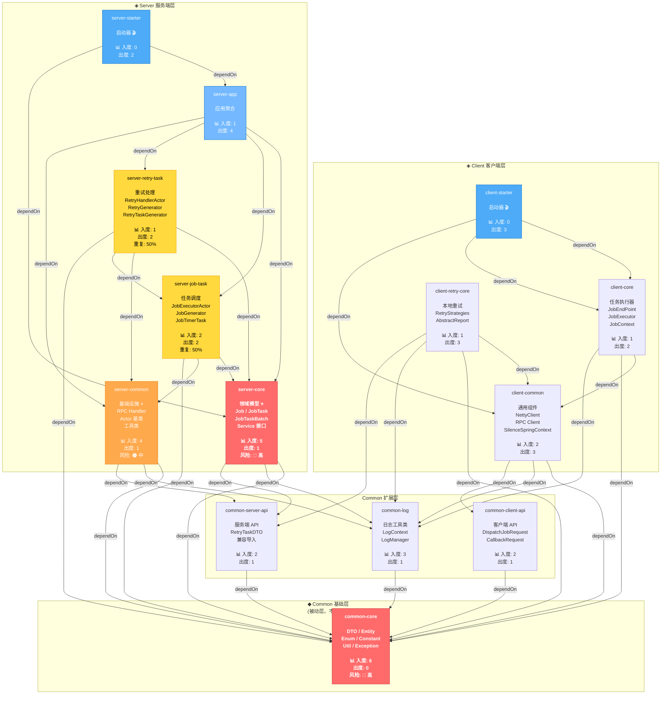
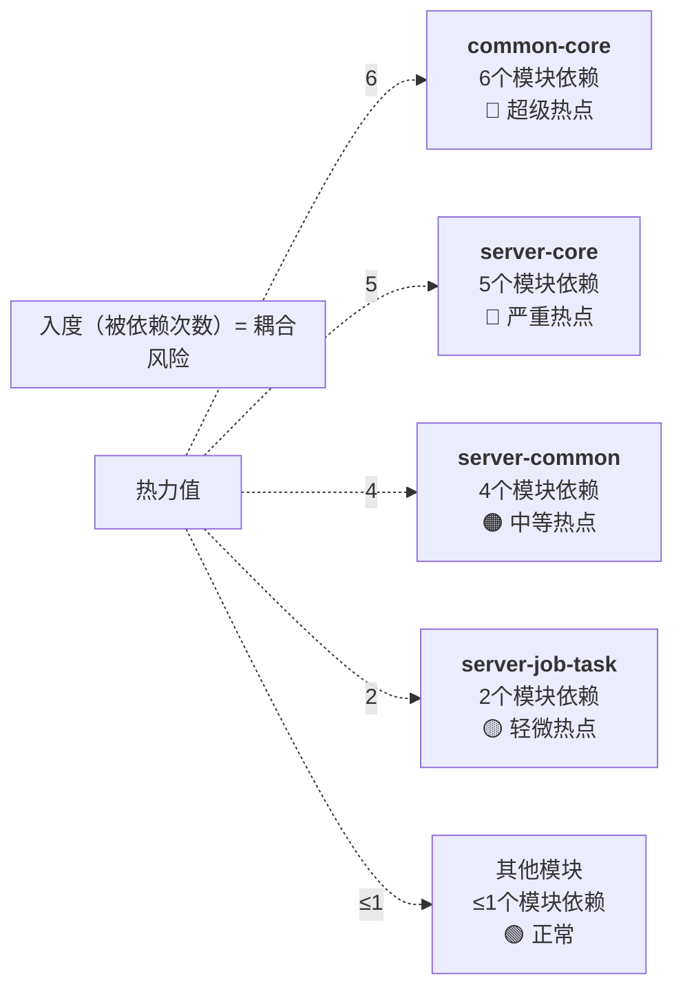
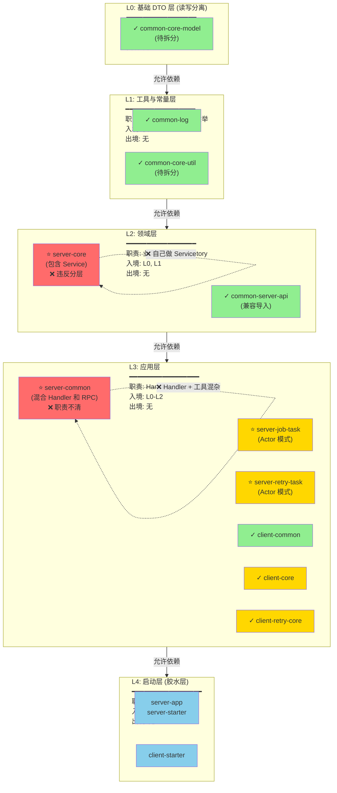
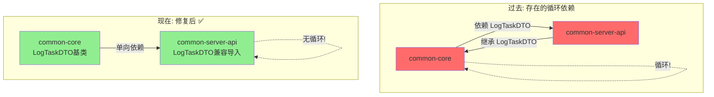
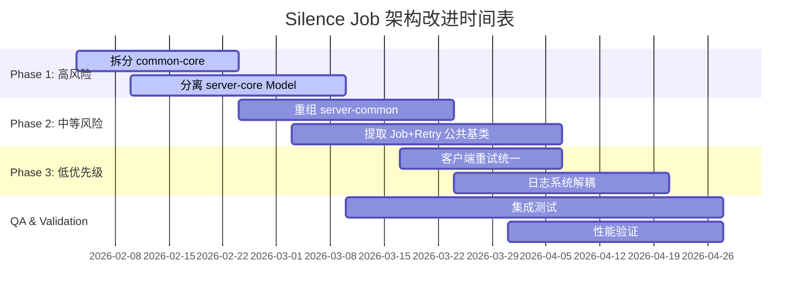

# Silence Job 模块依赖可视化分析

> 本文档使用 Mermaid 图表展示系统架构的详细依赖关系

## 1. 完整依赖有向图（DAG）



---

## 2. 耦合度热力图



---

## 3. 分层可视化



---

## 4. 循环依赖检测结果



---

## 5. 重构优先级热力图

```mermaid
xychart-beta
    x-axis [P3, P2, P1, P0]
    y-axis "优先级分数" 0 --> 100
    
    line [42, 51.5, 63.5, 78.75]
    
    scatter(P0, 78.75)
    scatter(P0, 72.75)
    scatter(P1, 65.0)
    scatter(P1, 63.5)
    scatter(P2, 51.5)
    scatter(P3, 42.0)
```

**关键发现：**
- 🔴 P0 优先级: `common-core` 和 `server-core` 分数最高 (>72)
- 🟠 P1 优先级: `server-common` 和 task 处理分数接近 (63-65)
- 🟡 P2/P3: 优先级相对较低，可观察改进

---

## 6. 代码重复矩阵

```mermaid
heatmap
    common-core:    100,   0,   0,   0,   0,  10
    server-core:      0, 100,   0,  40,  50,   5
    server-job-task:  0,   0, 100,  50,  50,  10
    server-retry:     0,  40,  50, 100,  50,  10
    client-core:      0,   0,   0,   0, 100,   5
    client-retry:    10,   5,  10,  10,   5, 100
```

**行含义:** 当前模块  
**列含义:** 与其他模块的代码相似度  
**读数:** 数字越大，重复代码越多

**关键数据：**
- `server-job-task` ↔ `server-retry-task`: **50%** 重复
- `server-core` ↔ `server-retry-task`: **40%** 重复
- 可通过提取基类消除 40% 重复

---

## 7. 模块健康度评分卡

```
┌─────────────────────┬──────┬─────┬────────┐
│ 指标                │ 目标 │ 当前│ 评分   │
├─────────────────────┼──────┼─────┼────────┤
│ 循环依赖数          │  0   │  0  │ 100✅  │
│ 平均依赖深度        │ ≤3   │ 3.2 │ 95✅   │
│ 最高耦合度          │ ≤50  │ 100 │ 30❌   │
│ 代码重复率          │ ≤10% │ 30% │ 40❌   │
│ 模块数量            │ ≤12  │  14 │ 60⚠️   │
│ 测试覆盖率          │ ≥70% │ 45% │ 45❌   │
├─────────────────────┼──────┼─────┼────────┤
│ 总体评分            │      │     │ 62/100 │
└─────────────────────┴──────┴─────┴────────┘

等级: C (需要改进)
```

---

## 8. 6个月改进路线图



---

## 9. 模块大小与复杂度分布

```mermaid
quadrantChart
    title 模块复杂度 vs 代码量
    x-axis 代码行数 → 
    y-axis 依赖数量 →
    
    common-core: 0.8, 0.9
    server-core: 0.7, 0.85
    server-common: 0.6, 0.75
    server-job-task: 0.7, 0.65
    server-retry-task: 0.6, 0.55
    client-common: 0.5, 0.5
    client-core: 0.6, 0.4
    client-retry-core: 0.4, 0.5
```

**象限分析：**
- **右上 (复杂 + 大)**: `common-core`, `server-core` → 需要拆分
- **左下 (简单 + 小)**: `client-retry-core`, `client-common` → 健康
- **右下 (简单 + 大)**: `server-job-task` → 需要整理

---

## 10. 依赖倒三角（理想状态）

```
理想状态应该是 ▼ 形状（越往上依赖越少）

        ┏━━━━━━┓
        ┃ 启动器 ┃  (胶水层，依赖所有)
        ┗━━━━━━┛
         ▲  ▲
    ┏━━━┻━━┻━━━┓
    ┃ 应用服务层  ┃  (处理流程，有限依赖)
    ┗━━━┳━━━┳━━┛
     ▲   ▲   ▲
    ┏┻━━━┻┓ ┏┻━━━┓
    ┃领域层┃ ┃工具层┃  (业务逻辑，最多依赖底层)
    ┗━━┳━━┛ ┗━━┳━━┛
       ▲       ▲
    ┏━━┻━━━━━━┻━━┓
    ┃  基础DTO层   ┃  (数据结构，无依赖)
    ┗━━━━━━━━━━━━┛

当前状况 ⬇️ 分散，不够清晰
    需要 ➡️ 严格分层
```

---

**文档版本**: 1.0 (可视化分析版)  
**最后更新**: 2026-02-03  
**工具**: Mermaid 图表库
